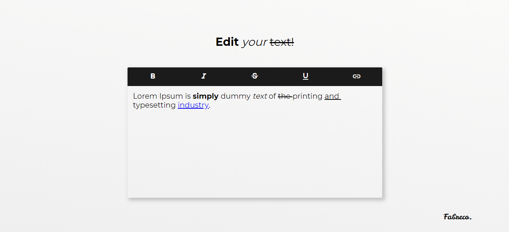

# Your text edited NOW!

## :eyes: Como ficou?

> OBS: Funcionalidades ainda não terminadas totalmente. 

## :man_technologist: Tecnologias usadas

O projeto foi desenvolvido visando utilizar as tecnologias HTML, CSS e JavaScript "puras", sem o auxílio de nenhum framework.  
Outros recursos utilizados:
- [Material Icons](https://material.io/resources/icons/)

## :computer: Sobre o projeto

O projeto consiste em um simples editor de texto, usando de tags HTML para a estilização do texto selecionado pelo usuário.  
A ideia para o projeto surgiu após a dica do ilustre [Felipe Deschamps ](https://github.com/filipedeschamps), em seu vídeo no YouTube [Desafio: 10 projetos rápidos para treinar Programação e conseguir um Emprego](https://www.youtube.com/watch?v=fYR9L2ZmodM).

## :memo: Licença

Esse projeto está sob a licença MIT. Veja o arquivo [LICENSE](LICENSE.md) para mais detalhes.

